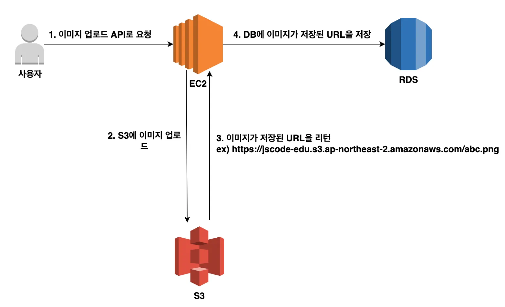
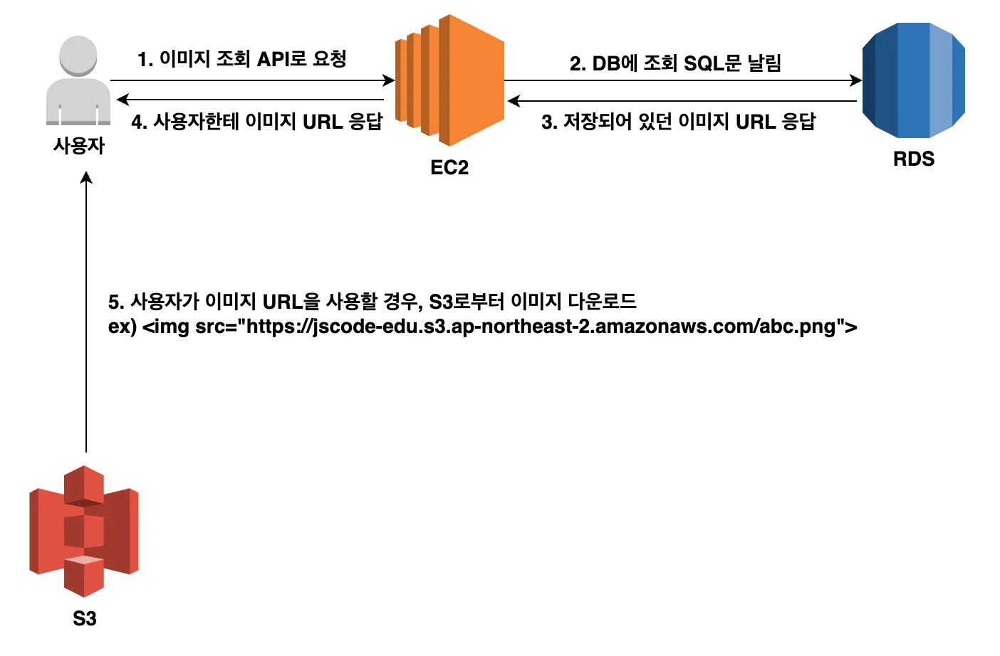
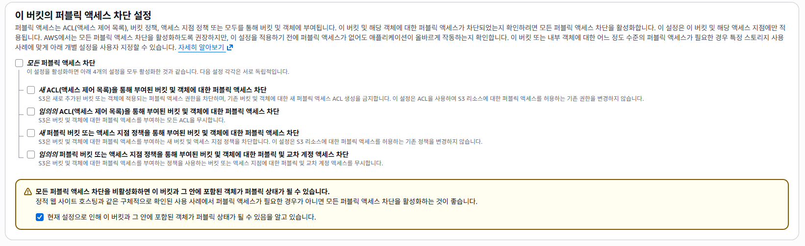
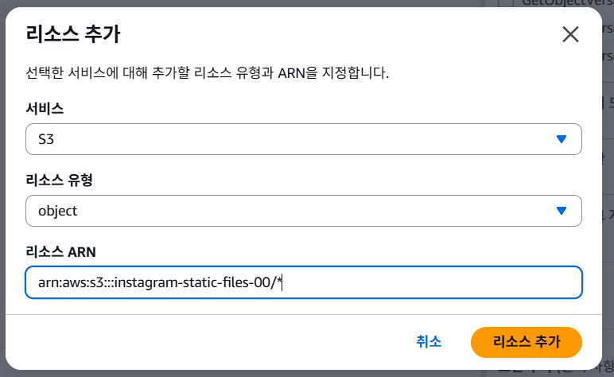

## RDS parameter 그룹 설정
DB 생성이 끝나고 나서 좌측의 `파라미터 그룹` 창으로 들어가서 파라미터 그룹 생성 클릭

instagram-db-parameter-group 이름 짓고 mySql community 선택 후 생성

생성한 파라미터 그룹 id 클릭하고 편집 들어감

character_set_client
character_set_connection
character_set_database
character_set_filesystem
character_set_results
character_set_server
의 parameter를 `utf8mb4`로 맞출겁니다.

참고 사항 : utf8이 아니라 utf8mb4를 사용하는 이유는 '한글'뿐만 아니라 '이모지'도 지원이 가능하도록 하기 위함.

collation_connection
collation_server
이상의 parameter를 utf8mb4_unicode_ci로 설정
utf8mb4_unicode_ci 얘는 utf8mb4에 정렬, 비교 방식 추가입니다.

time_zone의 속성을 Asia/Seoul 로 설정

# 현재 상황에서 연결과정은 수업 시간에 했습니다.

# S3로 이미지 저장소 만들기
## S3
- 한마디로 요약하자면 파일 저장 서비스
- 폰 내에 저장 용량이 있음에도 불구하고 왜 아이클라우드나 구글드라이브 등을 쓰는가를 생각해보시면 필요 이유를 알 수 있습니다.

- 업로드된 이미지 파일은 백엔드 서버가 실행되는 EC2 인스턴스 내부에 저장하는 것도 가능하지만, 서비스를 운영하는 과정에서 파일 개수가 많아지면 관리가 어려워질 수 있습니다. 파일을 저장할 공간이 한정되어있고, 인스턴스에 이상이 생기는 경우 데이터가 손실될 위험이 있기 때문에

- S3는 파일 용량에 제한이 없고 필요에 따라 자동으로 확장됩니다. 또한 데이터를 여러 물리적 위치에 분산하여 저장하기 때문에 데이터가 손실될 확률이 0.000000001%로 아주 희박하기 떄문에 실무에 사용됨

### 버킷
- 구글 드라이브에서 공유 드라이브를 여러 개 만들 수 있는 것처럼 S3에서도 저장소를 여러 개 만드는 것이 가능

### 객체
- 버킷에 업로드한 파일을 객체(Object)라고 표현합니다. 이 객체는 키-값(key-value) 쌍으로 이루어지는데, key는 객체에 할당한 이름, value는 업로드한 컨텐츠 자체를 의미함, 객체의 값은 byte 형태로 저장됨

## S3를 이용한 아키텍처 구성
1. 이미지 업로드 과정


2. 이미지 다운로드 과정


- 참고 : 편의상 이미지라고 했지만 video 및 pdf 등의 다양한 현식의 파일 전체를 포괄합니다.

## 버킷 생성
- 콘솔 홈에서 S3 검색 -> `버킷 생성` 버튼 클릭
`instagram-static-files`으로 임의로 이름 지었습니다.


퍼블릭 액세스 차단을 비활성화 하고, 경고 문구에 체크를 합니다.

## 버킷 사용을 위한 정책 설정하기
- AWS에서 자원을 생성하면 기본적으로 모든 권한이 차단되어 있는데, 에를 들어 S3 버킷을 만든 뒤에 이미지를 업도르 하려고 해도, 별도 권한을 설정하지 않으면 이 이미지에 접근하는 것이 불가능 합니다.

- 이 때, 우리는 `정책(Policy)`을 통해서 그 `권한(Permission)`을 설정할 수 있습니다.

- 정책 : _권한을 정의하는 `JSON` 문서_
  - 특정 서비스에서 상품 이미지를 _모든_ 사용자에게 보여주고 싶다면? 혹은 _특정_ 회원에게만 이미지, 비디오클립을 공유하고 싶다면? 에 해당하는 부분입니다.
  - 실습에서는 이미지 파일을 조회할 수 있도록 정책을 추가해보겠습니다.

  - 정책 편집에서 GetObject 이후 `리소스 추가` 선택
  

  - 최종 결과
``` json
{
	"Version": "2012-10-17",
	"Statement": [
		{
			"Sid": "Statement1",
			"Principal": "*",
			"Effect": "Allow",
			"Action": [
				"s3:GetObject"
			],
			"Resource": [
				"arn:aws:s3:::instagram-static-files-00/*"
			]
		}
	]
}
```

# S3에 파일 업로드가 가능하도록 IAM에서 액세스 키 발급 받기
1. IAM 대시보드에 좌측 -> `사용자` 선택
  - 사용자 이름을 설정하고 `다음` 버튼

2. 권한 정책 설정

3. 사용자 생성 완료 후 -> 액세스 키 발급
사용자에서 방금 만든 instagram-backend-server 클릭

  - 보안 자격증명 탭 클릭 후 -> 하단에 액세스 키 만들기

# 참고 : S3 버킷을 삭제하기 위해서는 내부 객체(파일)이 없어야만 합니다.

# S3를 활용한 정적 배포

## S3는 파일 저장 서비스라고 했는데...
  - S3가 파일 저장만 가능한 것이 아니라 _정적 웹 사이트 호스팅_ 기능도 지원합니다. 왜냐면 HTML이나 springboot 프로젝트의 경우 resources 폴더 내에 static이라는 폴더를 만들어서 html 문서를 집어넣는 경우가 있었기 때문입니다.

  ## CloudFront : 컨텐츠(파일, 동영상 등)을 빠르게 전송하게 해주는 서비스
  - 컨텐츠들은 S3라는 곳에 저장될겁니다. 그리고 그 S3 저장소가 한국에 있다고 했을 때, 한국인 사용자들은 데이터를 빠르게 전송 받을 수 있지만, 미국에 있는 사용자는 S3로부터 데이터를 전송 받을 때 시간이 오래 걸리겠네요.

- 이상의 문제를 해결하기 위해서 전세계 곳곳에 컨텐츠의 복사본을 저장해둘 수 있는 임시 저장소를 구축해둡니다. 그러면 미국에 있는 사용자가 컨텐츠를 전송받고 싶을 때, 가장 가까운 임시 저장소에서 컨텐츠를 가져오게 되고, 변경 사항만 체크해두면 됩니다. (마치 cache 개념 같죠)

- 이러한 서비스를 CDN(Content Delivery Network)라고 부릅니다. 그리고 CloudFront는 CND 서비스라고 합니다.

- 그렇다면 S3에 문서 파일을 집어넣게 되고 그걸 그냥 확인하게 되면 웹 서비스 배포이지 않나요? -> 맞습니다.

### CloudFront는 왜 필요한가? -> HTTPS를 적용하기 위해서입니다.
- S3에서는 HTTPS 적용 기능을 지원하지 않습니다.

- Netlify / Vercel / CloudFlare 등의 프론트엔드 배포 서비스도 존재합니다.

- 혹은 github-pages를 활용하면 리포지토리에 있는 프론트엔드 프로젝트를 https가 적용된 상태로 배포하는 것이 가능합니다.

- 일단 현업에서는 github-pages를 제외한 플랫폼들과 더불어 CloudFront도 고려 대상이라는 점만 확인하시면 됩니다.